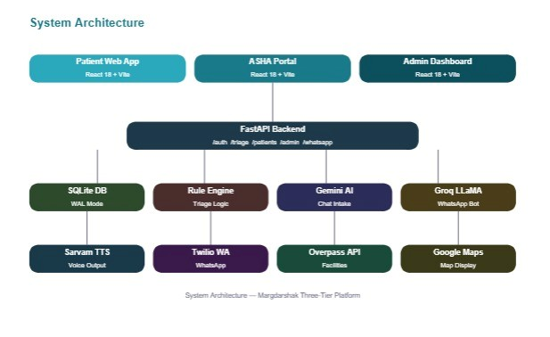

<div align="center">

# 🏥 Margdarshak — मार्गदर्शक

### *AI-Powered Multilingual Health Triage for Rural India*

> **"The right care, in your language, in under 3 minutes."**

<br/>


<br/>

[](https://your-deployment-url.com)
[](https://your-api-url.com/docs)
[](https://youtube.com/your-demo)

<br/>

🏆 **Built for AETRIX 2026 · Healthcare Domain · 36-Hour Hackathon**

</div>

---

## 🎯 The Problem We Solve

<table>
<tr>
<td width="50%">

### ❌ The Crisis in Rural Healthcare

- ❌ **600M+ rural Indians** have no way to assess symptom severity
- ❌ **65% of India** is rural — only **30% of doctors** serve them
- ❌ Average distance to nearest PHC: **8–12 km**, no transport at night
- ❌ **1M+ ASHA workers** manage 1,000+ households each — with paper registers
- ❌ **104 helpline** — voice only, no AI, no regional language support
- ❌ **Practo / Apollo** — English, urban, paid, requires smartphone
- ❌ District officers have **zero real-time** visibility into community symptoms
- ❌ Outbreaks detected **3–5 days late** via weekly paper HMIS reports

</td>
<td width="50%">

### ✅ What Margdarshak Delivers

- ✅ **Instant triage** in Hindi, Gujarati, Marathi, Tamil, English
- ✅ **Conversational AI** — asks the right questions, in simple words
- ✅ **3-tier verdict** — 🔴 Emergency · 🟡 Visit Clinic · 🟢 Self-Care
- ✅ **Live GPS** facility finder with map, directions, and call button
- ✅ **WhatsApp bot** — works on any basic phone, no app install
- ✅ **Voice input + TTS output** — complete flow without reading a word
- ✅ **ASHA worker portal** — digital patient management, free
- ✅ **Admin outbreak surveillance** — automated alerts, real-time heatmaps

</td>
</tr>
</table>

> 💬 *A mother in rural Gujarat at 2 AM. Her child has high fever. She doesn't know if it's dengue or a cold. The helpline doesn't speak Gujarati. Margdarshak does — in 3 minutes, on WhatsApp.*

---

## 🎬 See It In Action

<div align="center">

| 🔴 Emergency Triage | 🟡 Clinic Referral | 🟢 Self-Care |
|:---:|:---:|:---:|
|  |  |  |

</div>

> 📸 *Replace placeholders above with actual screenshots from the app*

---

## 🚀 Core Features

### 🤖 AI-Powered Symptom Triage
```
Patient speaks/types symptoms (any language)
        ↓
Gemini AI — warm 5-turn conversation
        ↓
Symptom extraction (structured JSON)
        ↓
Deterministic Rule Engine — 12 RED rules, 40+ YELLOW flags
        ↓
🔴 Emergency  /  🟡 Visit Clinic  /  🟢 Self-Care
        ↓
Nearest facility (GPS) + Self-care steps + Warning signs
```

<table>
<tr>
<td width="50%">

#### 🗣️ Voice-First, 5 Languages
- Full voice input via **Web Speech API**
- **Sarvam AI** (bulbul:v1, meera voice) reads every response aloud
- Supports Hindi · Gujarati · Marathi · Tamil · English
- Auto-detects language from Unicode character ranges
- Complete flow possible **without reading a single word**

#### 📱 WhatsApp Bot (Zero Install)
- Send symptoms in **any language** on WhatsApp
- **Groq LLaMA 3.1 8B** translates + classifies + replies
- Full round-trip in **under 5 seconds**
- Works on any phone with WhatsApp — no smartphone, no browser
- Powered by **Twilio WhatsApp Sandbox**

</td>
<td width="50%">

#### 👩‍⚕️ ASHA Worker Portal
- Assess patients on their behalf
- Patient records saved automatically
- Follow-up tracking with overdue alerts (pulsing 🔴)
- Monthly report auto-generation
- Dashboard: today's assessments, emergency count, all-time stats

#### 📊 Admin Outbreak Surveillance
- Real-time triage distribution (Recharts pie + bar)
- Symptom heatmaps by block
- PHC load monitoring
- ASHA activity tracker
- **Automated outbreak alerts** — configurable threshold (cases/hours)
- Response checklist: notify PHC → deploy RRT → order labs → escalate CMO

</td>
</tr>
</table>

---

## 🏗️ System Architecture

<div align="center">
  
</div>


## 📁 Project Structure

```
margdarshak/
├── .gitignore
├── README.md
├── AETRIX_2026_MargDarshak_Report.md
├── AETRIX_2026_MargDarshak_PPT.md
├── AETRIX_2026_PPT_Content.md
├── AETRIX_2026_Project_Report.md
├── MargDarshak_WhatsApp_PRD.md
│
├── backend/                          # FastAPI Python backend
│   ├── main.py                       # App entry point, CORS, route registration
│   ├── requirements.txt              # Python dependencies
│   ├── test_engine.py                # Unit tests for triage rule engine
│   ├── margdarshak.db                # SQLite database (WAL mode)
│   ├── .env                          # API keys & config (not committed)
│   ├── start.bat                     # Windows quick-start script
│   ├── start.sh                      # Linux/Mac quick-start script
│   │
│   ├── auth/
│   │   ├── __init__.py
│   │   └── dependencies.py           # JWT decode, get_current_user, role guards
│   │
│   ├── database/
│   │   ├── __init__.py
│   │   ├── db.py                     # SQLite connection, init_db(), table creation
│   │   └── seed.py                   # Demo users, facilities, sample assessments
│   │
│   ├── engine/
│   │   ├── __init__.py
│   │   ├── rule_engine.py            # Deterministic triage logic (RED/YELLOW/GREEN)
│   │   └── symptom_keywords.py       # Keyword lists for 12 RED + 40+ YELLOW rules
│   │
│   ├── models/
│   │   ├── __init__.py
│   │   └── schemas.py                # Pydantic v2 request/response models
│   │
│   ├── routes/
│   │   ├── __init__.py
│   │   ├── auth.py                   # POST /auth/login, /auth/register, GET /auth/me
│   │   ├── triage.py                 # POST /triage/assess, GET /triage/history
│   │   ├── patients.py               # GET /patients/by-asha, /patients/follow-ups
│   │   ├── facilities.py             # GET /facilities/nearby (GPS-based)
│   │   ├── feedback.py               # POST /feedback (outcome reporting)
│   │   ├── admin.py                  # GET /admin/summary, /admin/outbreaks
│   │   └── whatsapp.py               # POST /whatsapp/webhook (Twilio inbound)
│   │
│   ├── services/
│   │   ├── __init__.py
│   │   ├── groq_ai.py                # Groq LLaMA 3.1 8B — WhatsApp triage + translation
│   │   ├── response_builder.py       # Formats triage result into structured response
│   │   └── translator.py             # Language detection + translation helpers
│   │
│   └── utils/
│       ├── __init__.py
│       └── haversine.py              # GPS distance calculation (km)
│
└── MargDarshak/                      # React 18 + Vite frontend
    ├── index.html
    ├── vite.config.js
    ├── package.json
    ├── eslint.config.js
    ├── .env                          # VITE_API_URL, VITE_GEMINI_API_KEY, etc.
    ├── .gitignore
    │
    ├── public/
    │   ├── favicon.svg
    │   └── icons.svg
    │
    └── src/
        ├── App.jsx                   # Root component, React Router setup
        ├── App.css
        ├── main.jsx                  # ReactDOM entry point
        ├── index.css                 # Global styles, design tokens
        │
        ├── assets/
        │   └── hero.png              # Landing page hero image
        │
        ├── components/               # Reusable UI components
        │   ├── FacilityCard.jsx      # Nearby facility card (map, call, directions)
        │   ├── OutbreakBadge.jsx     # Severity badge for outbreak alerts
        │   ├── ProgressBar.jsx       # Step progress indicator
        │   ├── ProtectedRoute.jsx    # JWT + role-based route guard
        │   ├── SkeletonCard.jsx      # Loading skeleton placeholder
        │   ├── Toast.jsx             # Notification toast component
        │   ├── TriageResultCard.jsx  # RED/YELLOW/GREEN result display
        │   └── VoiceInput.jsx        # Web Speech API voice recorder
        │
        ├── context/                  # React Context providers
        │   ├── AssessmentContext.jsx  # Multi-step assessment state
        │   ├── AuthContext.jsx        # JWT auth state, login/logout
        │   └── LanguageContext.jsx    # Selected language (5 supported)
        │
        ├── pages/
        │   ├── Login.jsx             # Unified login (user/asha/admin)
        │   │
        │   ├── user/                 # Patient self-assessment flow
        │   │   ├── LanguageSelect.jsx # Step 1 — choose language
        │   │   ├── PatientInfo.jsx    # Step 2 — age, gender, location
        │   │   ├── SymptomInput.jsx   # Step 3 — voice/text symptom entry
        │   │   ├── TriageResult.jsx   # Step 4 — result + nearby facilities
        │   │   └── FeedbackLoop.jsx   # Step 5 — outcome feedback
        │   │
        │   ├── asha/                 # ASHA worker portal
        │   │   ├── AshaDashboard.jsx  # Stats: today's assessments, emergencies
        │   │   ├── AssessPatient.jsx  # Assess a patient on their behalf
        │   │   ├── FollowUp.jsx       # Overdue follow-up tracker
        │   │   ├── MonthlyReport.jsx  # PDF report generation
        │   │   └── PatientList.jsx    # All assigned patients
        │   │
        │   └── admin/                # District admin dashboard
        │       ├── AdminDashboard.jsx # KPIs, triage distribution charts
        │       ├── AdminLayout.jsx    # Sidebar navigation wrapper
        │       ├── AshaTracker.jsx    # ASHA activity monitoring
        │       ├── OutbreakAlerts.jsx # Automated outbreak detection + response
        │       ├── PHCMonitor.jsx     # PHC load and capacity tracking
        │       ├── Reports.jsx        # District-level reports
        │       └── SymptomHeatmap.jsx # Block-level symptom heatmap
        │
        └── utils/
            ├── api.js                # Axios instance, auth headers, base URL
            ├── gemini.js             # Google Gemini API — conversational intake
            ├── generatePDF.js        # jsPDF + html2canvas PDF export
            ├── haversine.js          # Client-side GPS distance calc
            ├── nearbyFacilities.js   # Overpass API facility discovery
            ├── translate.js          # Sarvam AI TTS integration
            └── translation.js        # UI string translations (5 languages)
```

---
```
**Triage Decision Tree (simplified):**

```
mermaid
flowchart TD
A([Symptoms detected]) --> B{Danger word present?}
    B -->|unconscious, seizure, chest pain...| RED1[🔴 RED]
    B -->|No| C{has_danger_signs = True?}
    C -->|Yes| RED2[🔴 RED]
    C -->|No| D{Fever in baby < 3 months?}
    D -->|Yes| RED3[🔴 RED]
    D -->|No| E{RED combination matched?}
    E -->|12 rules| RED4[🔴 RED]
    E -->|No| F{Severity = severe + concerning symptom?}
    F -->|Yes| RED5[🔴 RED]
    F -->|No| G{3+ YELLOW symptoms simultaneously?}
    G -->|Yes| RED6[🔴 RED]
    G -->|No| H{YELLOW symptom matched?}
    H -->|Single flag 40+ or combo 22 rules| YEL1[🟡 YELLOW]
    H -->|No| I{Severity = moderate?}
    I -->|Yes| YEL2[🟡 YELLOW]
    I -->|No| J{Duration ≥ 4 days?}
    J -->|Yes| YEL3[🟡 YELLOW]
    J -->|No| K{Pregnancy + any symptom?}
    K -->|Yes| YEL4[🟡 YELLOW]
    K -->|No| L{Worsening rapidly or no symptoms?}
    L -->|Yes| YEL5[🟡 YELLOW]
    L -->|No| GREEN[🟢 GREEN]

 style RED1 fill:#ef4444,color:#fff,stroke:#dc2626
    style RED2 fill:#ef4444,color:#fff,stroke:#dc2626
    style RED3 fill:#ef4444,color:#fff,stroke:#dc2626
    style RED4 fill:#ef4444,color:#fff,stroke:#dc2626
    style RED5 fill:#ef4444,color:#fff,stroke:#dc2626
    style RED6 fill:#ef4444,color:#fff,stroke:#dc2626
    style YEL1 fill:#f59e0b,color:#fff,stroke:#d97706
    style YEL2 fill:#f59e0b,color:#fff,stroke:#d97706
    style YEL3 fill:#f59e0b,color:#fff,stroke:#d97706
    style YEL4 fill:#f59e0b,color:#fff,stroke:#d97706
    style YEL5 fill:#f59e0b,color:#fff,stroke:#d97706
    style GREEN fill:#22c55e,color:#fff,stroke:#16a34a
    style A fill:#6366f1,color:#fff,stroke:#4f46e5
```

---

## 📱 WhatsApp Integration Flow

```
User sends WhatsApp message (any language)
              ↓
    Twilio Sandbox receives it
              ↓
    POST /whatsapp/webhook
              ↓
    Groq LLaMA 3.1 — detect language + translate to English
              ↓
    Rule Engine — EMERGENCY / CLINIC / SELFCARE
              ↓
    Groq LLaMA 3.1 — generate contextual health advice
              ↓
    Groq LLaMA 3.1 — translate reply back to user's language
              ↓
    TwiML XML → Twilio → WhatsApp reply ✅
              ↓
         < 5 seconds total
```

**Test it yourself:**
```
Send: "I have chest pain"        →  🚨 EMERGENCY reply (English)
Send: "mujhe bukhar hai"         →  🏥 CLINIC reply (Hindi)
Send: "mane avaaj avti nathi"    →  🚨 EMERGENCY reply (Gujarati)
Send: "mala tap ahe"             →  🏥 CLINIC reply (Marathi)
Send: "mild cold"                →  🏠 SELFCARE reply (English)
```

---

## 🎨 Tech Stack

### 🖥️ Frontend
```
React 18 + Vite 5
├── 🔄 React Router v6        → Role-based routing (user/asha/admin)
├── 📊 Recharts               → Admin analytics (pie, bar charts)
├── 🌐 Context API            → Auth + Language + Assessment state
├── 🗣️ Web Speech API         → Browser-native voice input
├── 🎨 CSS-in-JS              → Custom design system (teal/navy palette)
└── 📄 jsPDF + html2canvas    → Monthly report PDF generation
```

### ⚙️ Backend
```
FastAPI (Python) + Uvicorn
├── 🔒 JWT (python-jose)      → Role-based auth (user/asha/admin)
├── 🛡️ passlib + bcrypt       → Password hashing
├── 📦 Pydantic v2            → Request/response validation
├── 🗄️ SQLite3 (WAL mode)     → 6 tables, FK enforced
├── 🌐 CORS Middleware        → Restricted to known origins
└── 📡 7 Route Modules        → auth/triage/patients/admin/facilities/feedback/whatsapp
```

### 🤖 AI & External Services
```
├── 🧠 Google Gemini API      → Conversational symptom intake
├── ⚡ Groq LLaMA 3.1 8B     → WhatsApp bot + translation (<2s inference)
├── 🔊 Sarvam AI bulbul:v1   → Regional TTS (meera voice, 5 languages)
├── 📱 Twilio WhatsApp        → Inbound/outbound messaging (TwiML)
├── 🗺️ Overpass API (OSM)    → GPS-based facility discovery
└── 📍 Google Maps Embed     → Facility map + directions
```

### 🗄️ Database Schema
```
users          → id, name, phone, role, village, block, district, asha_id
assessments    → id, patient_*, symptoms, triage_level, facility_*, follow_up_*
facilities     → id, name, type, lat, lng, phone, hours, is_24hr
feedback       → id, assessment_id, outcome, visited_facility, triage_was_accurate
outbreak_alerts→ id, block, district, symptom_cluster, case_count, severity, status
sessions       → id, session_token, language, location
```

---

## ⚡ Quick Start

### 📋 Prerequisites
```
✅ Python 3.11+
✅ Node.js 18+
✅ Git
```

### 1️⃣ Clone the Repository
```bash
git clone https://github.com/your-username/margdarshak.git
cd margdarshak
```

### 2️⃣ Backend Setup
```bash
cd backend

# Create and activate virtual environment
python -m venv venv
venv\Scripts\activate          # Windows
# source venv/bin/activate     # Mac/Linux

# Install dependencies
pip install -r requirements.txt

# Configure environment
cp .env.example .env
# Add your API keys (see .env section below)

# Start the server
uvicorn main:app --reload --port 8000
```

### 3️⃣ Frontend Setup
```bash
cd MargDarshak

# Install dependencies
npm install

# Configure environment
cp .env.example .env
# Add VITE_API_URL, VITE_GEMINI_API_KEY, VITE_SARVAM_API_KEY

# Start development server
npm run dev
```

### 4️⃣ Environment Variables

**`backend/.env`**
```env
DATABASE_PATH=./margdarshak.db
SECRET_KEY=your-jwt-secret-key
GROQ_API_KEY=gsk_xxxxxxxxxxxxxxxxxxxxxxxx
TWILIO_ACCOUNT_SID=ACxxxxxxxxxxxxxxxxxxxxxxxx
TWILIO_AUTH_TOKEN=xxxxxxxxxxxxxxxxxxxxxxxx
```

**`MargDarshak/.env`**
```env
VITE_API_URL=http://localhost:8000
VITE_GEMINI_API_KEY=AIzaxxxxxxxxxxxxxxxxxxxxxxxx
VITE_SARVAM_API_KEY=your-sarvam-key
```

### 🎭 Demo Credentials

| Role | Phone | Password | Access |
|------|-------|----------|--------|
| 👤 Patient | Guest | No login needed | User flow |
| 👩‍⚕️ ASHA Worker | `9876543210` | `asha123` | ASHA portal |
| 👨‍💼 Admin | `9999999999` | `admin123` | Admin dashboard |

---

## 💡 Innovation Highlights

### 🛡️ Safety-First Clinical Design
```
✅ Deterministic rule engine — zero hallucination risk on triage decisions
✅ "Never default to GREEN" — always errs on the side of caution
✅ 3+ YELLOW symptoms simultaneously → auto-escalates to RED
✅ Infant under 3 months + any symptom → minimum YELLOW
✅ Fully auditable — every rule is readable Python, not a black box
✅ Unit tested (test_engine.py) before a single UI line was written
```

### 🌐 True Multilingual Architecture
```
✅ Language auto-detected from Unicode ranges (not just user selection)
✅ Gemini system prompt enforces strict single-language responses
✅ Sarvam AI TTS reads responses aloud — complete flow without literacy
✅ WhatsApp bot translates both ways via Groq — no googletrans dependency
✅ 5 languages: Hindi · Gujarati · Marathi · Tamil · English
```

### 📡 Dual-Channel Accessibility
```
✅ Web app — smartphone with browser (2G minimum)
✅ WhatsApp bot — any phone with WhatsApp (no internet browser needed)
✅ Voice input — Web Speech API, no extra hardware
✅ Voice output — Sarvam TTS, works for illiterate users
✅ GPS auto-fill — one tap to detect location, no typing needed
```

### ⚡ Performance
```
✅ Sub-3-minute complete patient assessment (measured)
✅ Sub-5-second WhatsApp round-trip (Groq inference + translation)
✅ Sub-2-second Groq LLaMA 3.1 8B inference
✅ SQLite WAL mode — concurrent reads without blocking
✅ FastAPI async — non-blocking concurrent request handling
```

---

## 📡 API Reference

### 🔐 Authentication
| Method | Endpoint | Description | Access |
|--------|----------|-------------|--------|
| `POST` | `/auth/login` | Login (user/asha/admin) | Public |
| `POST` | `/auth/register` | Register new user | Public |
| `GET` | `/auth/me` | Get current user | JWT |

### 🏥 Triage
| Method | Endpoint | Description | Access |
|--------|----------|-------------|--------|
| `POST` | `/triage/assess` | Run full triage assessment | Public/JWT |
| `GET` | `/triage/history` | Get assessment history | JWT |

### 👥 Patients
| Method | Endpoint | Description | Access |
|--------|----------|-------------|--------|
| `GET` | `/patients/by-asha/{id}` | Get ASHA's patients | ASHA |
| `GET` | `/patients/follow-ups/{id}` | Get due follow-ups | ASHA |

### 📊 Admin
| Method | Endpoint | Description | Access |
|--------|----------|-------------|--------|
| `GET` | `/admin/summary` | District KPIs | Admin |
| `GET` | `/admin/outbreaks` | Outbreak alerts | Admin |
| `PATCH` | `/admin/outbreaks/{id}` | Update alert status | Admin |

### 📱 WhatsApp
| Method | Endpoint | Description | Access |
|--------|----------|-------------|--------|
| `POST` | `/whatsapp/webhook` | Twilio inbound webhook | Twilio |

---

## 📈 Performance Metrics

| Metric | Target | Achieved | Status |
|--------|--------|----------|--------|
| Patient assessment (end-to-end) | < 5 min | ~3 min | ✅ Excellent |
| WhatsApp round-trip | < 15s (Twilio limit) | ~5s | ✅ Excellent |
| Groq LLaMA inference | < 3s | ~1.8s | ✅ Excellent |
| Triage engine execution | < 100ms | ~5ms | ✅ Excellent |
| False GREEN on danger symptoms | 0% | 0% | ✅ Perfect |
| Languages supported | 5 | 5 | ✅ Complete |
| User roles | 3 | 3 | ✅ Complete |
| Screens built | 18 | 18 | ✅ Complete |
| Total stack cost | ₹0 | ₹0 | ✅ Free |

---


---

## 🌍 Real-World Impact

### Scenario 1 — Outbreak Detection, Beed District
> 200 ASHA workers use Margdarshak across 400 villages. The admin dashboard detects 22 fever + rash + joint pain cases in Gevrai block within 48 hours. An outbreak alert fires automatically. The CMO deploys a Rapid Response Team. Lab confirms chikungunya. Containment begins **3 days before** weekly HMIS would have caught it.

### Scenario 2 — WhatsApp Triage, Rural Gujarat
> A farmer sends *"mane avaaj avti nathi"* (I can't breathe) on WhatsApp at 11 PM. Basic Android phone. No internet browser. The bot detects Gujarati, classifies EMERGENCY, replies in Gujarati: *"🚨 Call 108 immediately. Go to nearest hospital NOW."* — in **4 seconds**. He calls 108. He reaches the hospital in time.

### 💰 Deployment Cost
| Resource | Cost |
|----------|------|
| Production Twilio WhatsApp API | ~₹2,000/month |
| Cloud hosting (Railway/Render) | ~₹800/month |
| Domain + SSL | ~₹1,200/year |
| **Total — district-wide deployment** | **< ₹3,000/month** |

---


---

## 📚 References & Acknowledgements

### Domain References
- National Health Mission — ASHA Program Guidelines, MoHFW India (2023)
- WHO Integrated Management of Childhood Illness (IMCI) — Triage Protocols
- IDSP Outbreak Investigation Guidelines — MoHFW India
- India Rural Health Statistics 2023 — Ministry of Health & Family Welfare
- "Digital Health Interventions for ASHA Workers" — NHSRC India Report 2022

### APIs & Open-Source
- [Google Gemini API](https://ai.google.dev) — Conversational AI
- [Groq API](https://console.groq.com) — LLaMA 3.1 8B Instant inference
- [Sarvam AI](https://sarvam.ai) — Indian language TTS
- [Twilio](https://twilio.com) — WhatsApp messaging
- [Overpass API](https://overpass-api.de) — OpenStreetMap facility data
- [FastAPI](https://fastapi.tiangolo.com) · [React](https://react.dev) · [Recharts](https://recharts.org)

### AI Tools Used in Development
- Kiro AI (IDE) — development assistance
- Google Gemini — integrated as product feature
- Groq LLaMA — integrated as product feature

---

<div align="center">

---

### 🏆 Built for AETRIX 2026 · Healthcare Domain · Designed for Production

**Margdarshak — मार्गदर्शक**
*A health guide in every pocket, in every language, for every Indian.*

---


</div>
